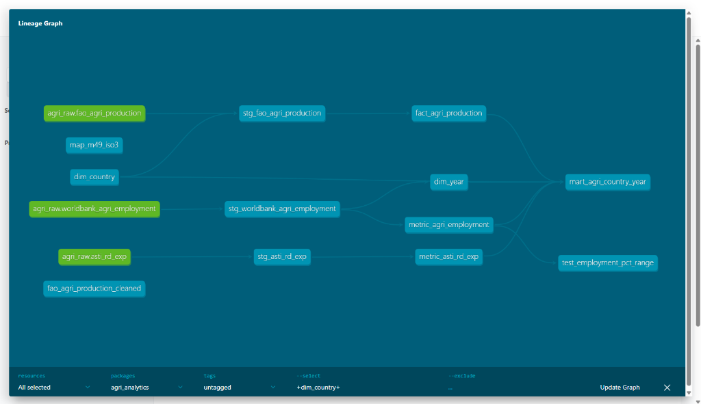
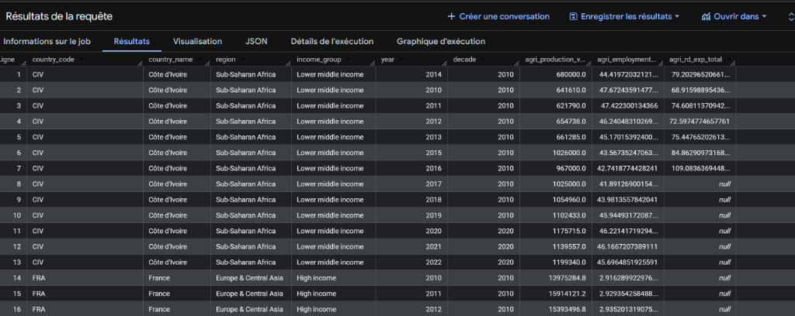
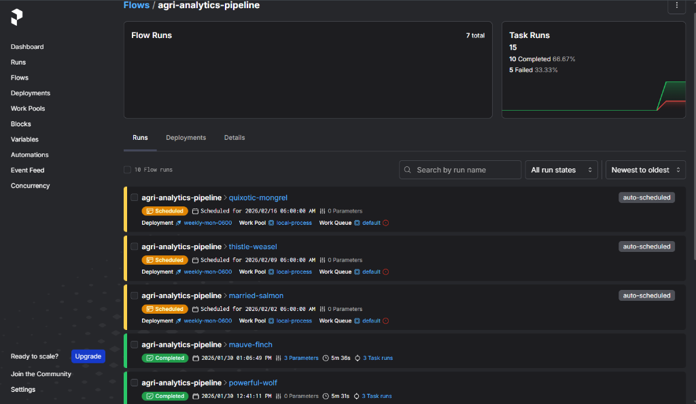
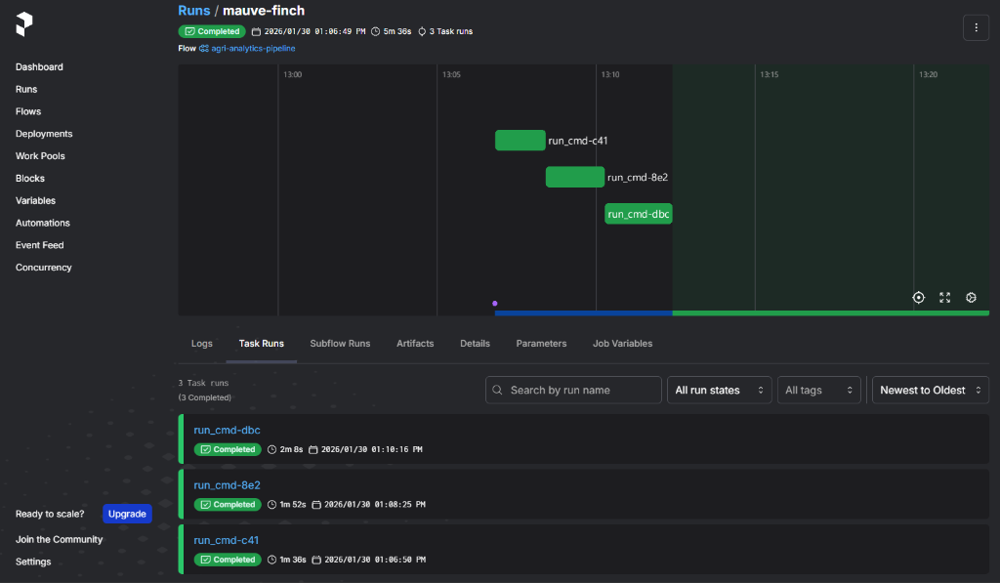

# Agri Analytics Pipeline
End-to-end data engineering pipeline for agricultural indicators (production, employment, R&D).

## Project Overview

This project implements an end-to-end data engineering pipeline focused on agricultural analytics.
It integrates multiple public international data sources to produce country-year level metrics
used for analysis and decision-making.

The goal is to demonstrate:
- multi-source data ingestion
- analytical data modeling (star schema)
- data quality enforcement
- pipeline orchestration and scheduling

## Data Sources

- World Bank (Data360): Agricultural employment (% of total employment)
- FAO: Agricultural production volumes
- IFPRI / ASTI: Agricultural R&D expenditures

All sources are public and loaded into BigQuery as raw datasets.

## Architecture

Raw Data (BigQuery)
→ Staging Models (dbt)
→ Dimensions & Facts
→ Analytical Mart
→ Orchestration & Scheduling (Prefect)




## Data Model

Star schema at country-year grain:

- Dimensions:
  - dim_country
  - dim_year

- Facts / Metrics:
  - agricultural production
  - agricultural employment (%)
  - agricultural R&D expenditure

Final mart:
- mart_agri_country_year




## Data Quality

Implemented with dbt tests:
- not_null constraints
- unique combination of keys (country_code, year)
- value range checks (employment percentage)

Tests are executed automatically within the pipeline.

## Orchestration

The pipeline is orchestrated using Prefect.

Steps:
1. dbt seed
2. dbt run
3. dbt test

Scheduling:
- Weekly execution (Monday 06:00 – Europe/Paris)

The pipeline is observable via the Prefect UI (runs, logs, retries).





## Tech Stack

- BigQuery (Data Warehouse)
- dbt (Transformations & tests)
- Prefect (Orchestration & scheduling)
- Python

## Run Locally

Requirements:
- Python
- dbt
- Prefect
- Google Cloud credentials

Run Prefect server:
```bash
prefect server start
```

Start worker:
```bash
prefect worker start --pool local-process
```

Trigger pipeline:
```bash
python orchestration/flow_agri_pipeline.py
```
